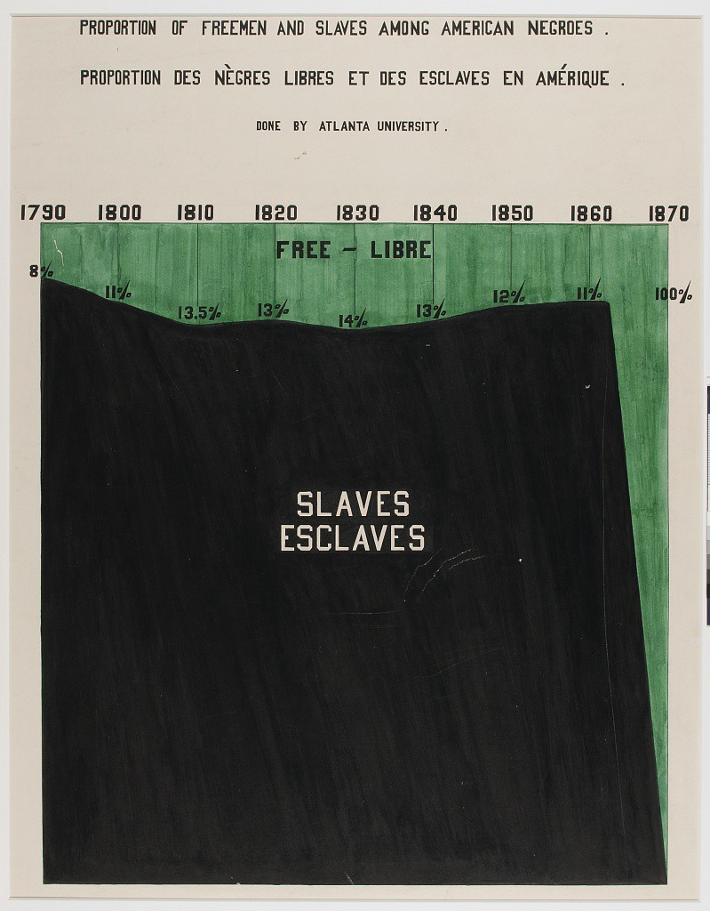

# Examples 

To show how to use the package in more detail we show how to use the recipes to replicate 
the original plates by DuBois.

```@example 1
using DuBoisPlots
using DataFrames
df = DataFrame(
        Year = [1790,1800,1810,1820,1830,1840,1850,1860,1870],
        Slaves = [92,88.5,86.5,87,86,87,88,89,0],
        Free =  [8.0, 11.5, 13.5, 13.0, 14.0, 13.0, 12.0, 11.0,100],
        )
p = Plate51(df, :Year; title="Proportion of Slaves")
```

Which creates the following:

## Plate 7


## Plate 10


## Plate 11


## Plate 25


## Plate 51


## Plate 53


